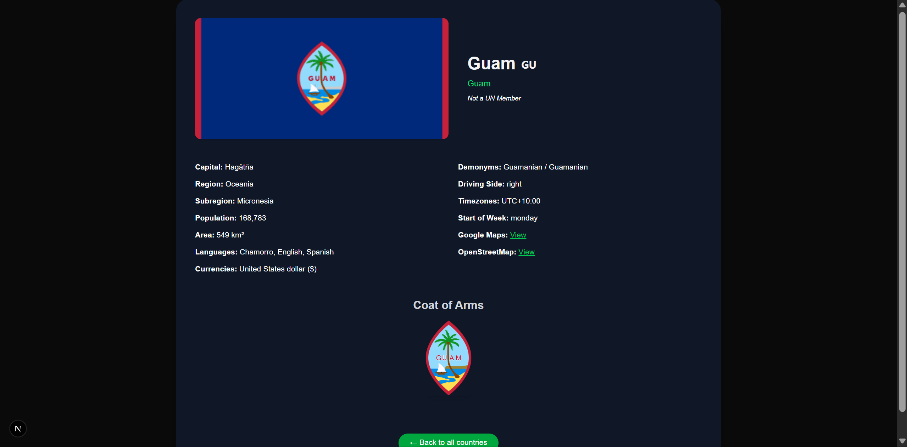

# Welcome to Country Explorer README

This is a website designed which is used for getting some information from some information and query information about all country.

The website uses api form [Rest Countries API](https://restcountries.com) for querying data like country name, capital, region subregion, population, time zone and their image url.

## Querying Data from Country Explorer

| Query        | Description                                                                                                              |
| ------------ | ------------------------------------------------------------------------------------------------------------------------ |
| Name         | This get country from the specified name and get all country containing the character you specified                      |
| Currency     | This use the currency you input to get all the country using the currency you specify or start with the name you inputed |
| Language     | This uses the language you specify to query for all country speaking the language                                        |
| Capital City | This uses the capital city you specify to get all the country or the particular country with that exact capital city     |
| Region       | This uses the region you specify to get all country in that specified region                                             |
| Sub Region   | This query all country with that particular Sub Region                                                                   |

## Learn More Country Explorer Route
